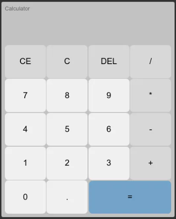

# Calculadora

## Este projeto é uma calculadora simples baseada em HTML, CSS e JavaScript. A interface é amigável e permite ao usuário realizar operações matemáticas básicas como adição, subtração, multiplicação e divisão.

# Estrutura do Projeto

## O projeto está dividido em três principais arquivos:

HTML (index.html)
CSS (style.css)
JavaScript (script.js)
HTML (index.html)

## O arquivo HTML define a estrutura da calculadora, incluindo a área de visualização das operações e os botões numéricos e operacionais.

# CSS (style.css)

## O arquivo CSS define o estilo visual da calculadora, incluindo cores, fontes e layout dos botões e áreas de exibição.

# JavaScript (script.js)

## O arquivo JavaScript define a lógica da calculadora, incluindo como os números e operações são processados e exibidos na tela.

# Funcionalidades

## A calculadora permite:

Adicionar Dígitos e Pontos Decimais:

Dígitos e pontos decimais podem ser adicionados à operação atual.

Operações Básicas:

Adição, subtração, multiplicação e divisão.
Operações de Controle:

CE (Clear Entry): Limpa a entrada atual.
C (Clear): Limpa todas as entradas e operações.
DEL (Delete): Apaga o último dígito da entrada atual.
Operação de Igual:

=: Calcula o resultado da operação atual.

# Como Usar

## Abrir o Arquivo HTML:

Abra o arquivo index.html em um navegador para ver a calculadora em ação.
Interação com a Calculadora:

Clique nos botões para inserir números e operações.
Utilize os botões de operação (+, -, \*, /) para realizar cálculos.
Use CE, C e DEL para gerenciar entradas e operações.
Pressione = para obter o resultado da operação
